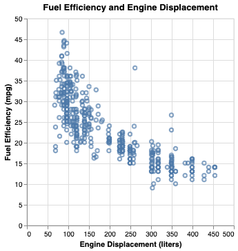
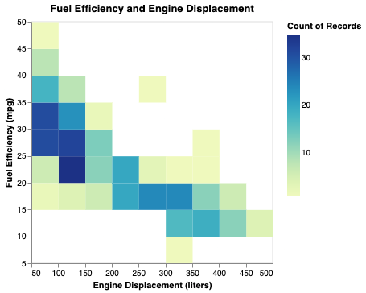
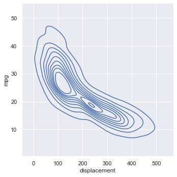
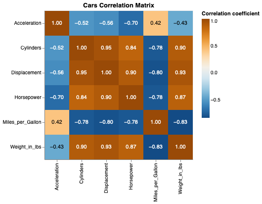

% Correlation
% CIS 241: Data Mining
% Dr. Ladd

# Are Two Variables Related?

Not *how* they are related.

## Our first form of bivariate analysis.

Correlation always involves two or more variables (columns).

## Correlation coefficient measures the extent to which two variables are related, from -1 to 1.

Pearson’s correlation coefficient multiplies the deviations from the mean for two variables, and divides by the product of the standard deviation.

Tells us the *strength* of a correlation.

## Pearson's correlation, *r*, is the default in Pandas.

```python
# Load cars sample dataset
cars = data.cars()

# Calculate correlations between all columns in a dataframe 
cars.corr(numeric_only=True)

# Calculate correlation between just two variables
cars.Miles_per_Gallon.corr(cars.Displacement)
```

# Visualizing Correlation

## Scatterplots show potential correlation between two variables

The y-axis shows the *dependent* variable, while the x-axis shows the *independent* variable.

---



```python
alt.Chart(cars, title="Fuel Efficiency and Engine Displacement").mark_point().encode(
    x=alt.X("Displacement:Q", title="Engine Displacement (liters)"),
    y=alt.Y("Miles_per_Gallon:Q", title="Fuel Efficiency (mpg)")
).interactive()
```

---

```python
# Add a line of best fit to make a regression plot
scatter = alt.Chart(cars, title="Fuel Efficiency and Engine Displacement").mark_point().encode(
    x=alt.X("Displacement:Q", title="Engine Displacement (liters)"),
    y=alt.Y("Miles_per_Gallon:Q", title="Fuel Efficiency (mpg)")
).interactive()

scatter + scatter.transform_regression('Displacement','Miles_per_Gallon').mark_line()
```


## Avoid overplotting with heatmaps or kernel density estimation.

:::::::::::::: {.columns}
::: {.column width="50%"}

:::
::: {.column width="50%"}

:::
::::::::::::::

## Make these with different marks or transforms.

```python
# Heatmap example
alt.Chart(cars, title="Fuel Efficiency and Engine Displacement").mark_rect().encode(
    x=alt.X("Displacement:Q", title="Engine Displacement (liters)").bin(),
    y=alt.Y("Miles_per_Gallon:Q", title="Fuel Efficiency (mpg)").bin(),
    color=alt.Color("count():Q")
)
```

## Correlation matrix shows all possible correlations.



---

```python
# Re-arrange correlation matrix data
cars_corr = (cars.corr(numeric_only=True)
             .stack()
             .reset_index()
             .rename(columns={0:'corr','level_0':'var1','level_1':'var2'})
            )
# Create correlation heatmap
base = alt.Chart(cars_corr, title="Cars Correlation Matrix").mark_rect().encode(
    x=alt.X("var1:N",title=None),
    y=alt.Y("var2:N",title=None),
    color=alt.Color("corr",title="Correlation coefficient").scale(scheme='blueorange')
).properties(width=300,height=300)
# Add text labels for coefficients
text = base.mark_text(baseline='middle').encode(
    alt.Text('corr:Q', format=".2f"),
    color=alt.condition(
        (alt.datum.corr < -0.5) | (alt.datum.corr > 0.5),
        alt.value('white'),
        alt.value('black')
    )
)
base+text # Display visualization
```

# Hypothesis Tests for Correlation

## How do we know if a correlation coefficient is statistically significant?

There are standard parametric approaches to this, but we can use permutation!

## Instead of resampling, we can *rearrange* the variables at random.

```python
def simulate_correlation(df,var1,var2):
    shuffled = df[var1].sample(frac=1).reset_index(drop=True)
    corr = shuffled.corr(df[var2])
    return corr
```

## Let's Try It!

Using the function from the previous slide, run 5000 permutations of the correlation between engine displacement and miles per gallon.

Graph the results as a histogram and calculate a p-value. Is this a statistically significant correlation?

# Don't be fooled!

---

Always use summary statistics and visualization *together*.


## If we have the same **mean**, **standard deviation**, and **correlation** we might expect the data sets to be similar...

---

But they could be very clearly and visually **distinct**!


## Data Challenge

Use `pandas` to find the summary statistics for each dataset in the <a href="/CIS241/data/DatasaurusDozen.tsv" download>`datasaurus_dozen`</a>.

- Find mean, standard deviation, and correlation for both x and y of each dataset. (You may need to group things by the "dataset" column.)
- When you're done, try making scatter plots! (You may need to use the `column` encoding.)
