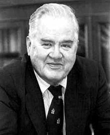
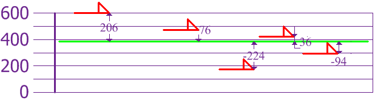
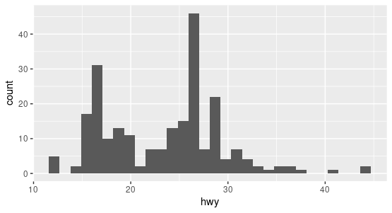

% Exploratory Data Analysis
% CIS 241, Dr. Ladd

# *Look* at the Data

## John Tukey (1962)



# Summary Statistics

## Summary Statistics are focused on the **location**, **variability**, and **distribution** of data.

# Location: What is the data's "typical value"?

## Let's imagine a variable showing the heights of different dogs.


## Mean is the sum of all values divided by the number of values.

AKA "average"


$\dfrac{600+470+170+430+300}{5} = 394$

## We can calculate the mean easily in Python.

```python
# Put the dog heights into a dataframe
dogs = pd.DataFrame({"height": [600, 470, 170, 430, 300]})

dogs.height.mean() # Calculate the mean
```

## Median is the value such that half of the data lies above and below.

AKA "50th percentile"


```python
dogs.height.median()
```

## Percentile is a value such that *P* percent of the data lies below.

AKA "quantile"

## The 25th Percentile is the 1st Quartile.


```python
dogs.describe()
```

## The 75th Percentile is the 3rd Quartile.


```python
dogs.describe()
```

## The median is the 2nd Quartile!!

## An **outlier** is a data value that's different from most of the data.

AKA "extreme value"

## A **robust** variable is not sensitive to extreme values.

# Variability: Is the data tightly clustered or spread out?

## The **interquartile range** is the difference between the 1st and 3rd quartiles.

```python
dogs.height.quantile(.75)-dogs.height.quantile(.25)
```

## A **deviation** is the difference between an actual value and an estimate of location (like the mean).



## The **variance** is the sum of the squared deviations, divided by the number of values.


$\dfrac{206^2+76^2+(-224)^2+36^2+(-94)^2}{5} = 21,704$

## The **standard deviation** is the square root of the variance.


Rottweilers *are* tall, and dachsunds *are* short---compared to the standard deviation from the mean.

## Now calculate the variance and standard deviations in Python.

```python
dogs.height.var()

dogs.height.std()
```

Were these the results you expected?

## Population vs. Sample

When you have "N" data values:

- The Entire Population: divide by N when calculating variance (like we did)
- A Sample: divide by N-1 when calculating variance

Sample variance: $\dfrac{108,520}{4}=27,130$  
Sample standard deviation: $\sqrt{27,130}=164$

Think of it as a "correction" when your data is only a sample. Pandas does this by default!

## Neither the mean, variance, nor standard deviation are **robust**. They are all very sensitive to outliers!

# Distributions: How many of each value are there?

## Histograms show distributions based on frequency counts.



## The normal distribution has most values in the middle.


Be careful: normal distributions are assumed for many statistical analyses!

## Boxplots show distribution based on the median.


# Correlation: Are two variables related?

## Location, Variability, and Distribution are for one variable at a time (univariate analysis). Correlation is for *two* variables (bivariate analysis).

## Scatter plots and correlation coefficients are used to determine correlation.

We'll talk more about correlation in a couple weeks!

# Resampling and Confidence Intervals

## Resampling is simply drawing multiple random samples from observed data.

I can grab a sample of 5 observations. Then I can "resample" 5 more. Then 5 more, and so on and so on.

## First proposed in the 1960s, resampling procedures weren't practical until computing took off in the 1980s.

## Resampling is an umbrella term. It can include:

- The Bootstrap, used to assess the reliability of an estimated statistic
- Permutation Tests, used as an alternative to parametric hypothesis tests

## You can resample with or without *replacement*.

Replacement means an item is returned to the sample before the next draw (i.e. you could wind up with the same observation multiple times).

## Using bootstrap sampling, we can estimate a confidence interval for any summary statistic.

- Remember: bootstrap sampling is sampling *with* replacement.
- The 90% confidence interval tells us where 90% of the data is likely to fall, if the data were random.
- Confidence intervals are used to gauge *uncertainty*. 

## Confidence intervals with Pandas

```python
n_rows = dogs.shape[0] # First find the number of rows in the dataframe.

# Then take a sample with replacement from your dataset, and
# Calculate the mean each time. Do this 5000 times.
bootstrap_samples = [dogs.sample(n=n_rows, replace=True).height.mean()
                     for i in range(5000)]
# Put the results into a pandas Series object
bootstrap_samples = pd.Series(bootstrap_samples)

# Calculate the 95th percentile and the 5th percentile.
top_percentile = bootstrap_samples.quantile(.95)
bottom_percentile = bootstrap_samples.quantile(.05)

# Print the results using nice f-strings.
print(f"""The mean dog height in our data is {dogs.height.mean():.3f},
      with a 90% confidence interval
      of {bottom_percentile:.3f} to {top_percentile:.3f}.""")
```
