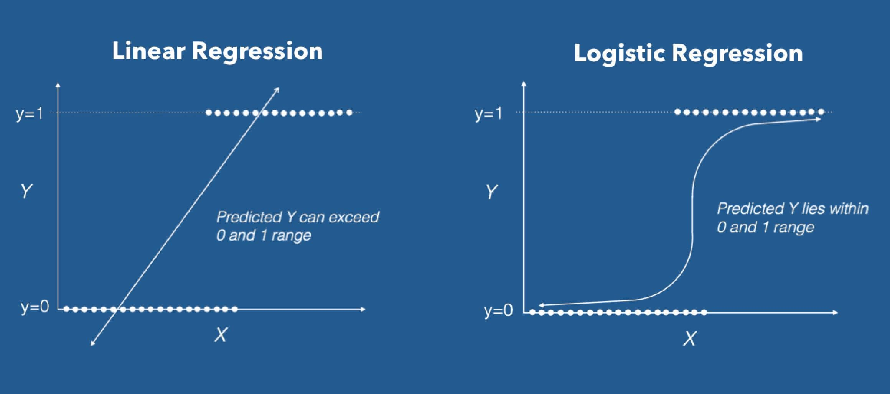
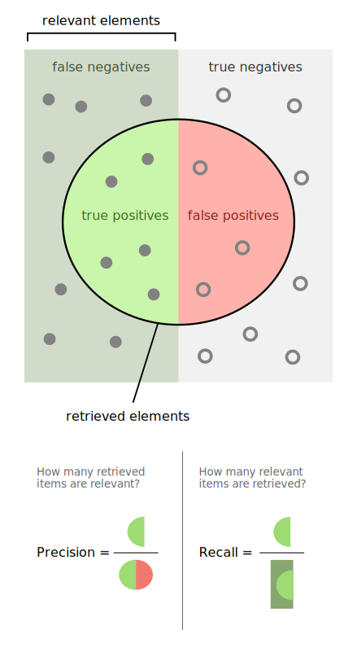

% Logistic Regression
% CIS 241, Dr. Ladd


# What is Logistic Regression?

AKA Logit Regression, Maximum-Entropy Classification

## How do we predict a *category*?

Logistic Regression is our first **classification** method.

## Logistic regression is a *linear* model.



## Instead of predicting a *value*, we predict the *probability of a category*.

## Traditional logistic regression is a *binary* classifier.

# Calculating Logistic Regression

---


## Let's create a model to classify penguins by species.

First, load in the `penguins` dataset in Seaborn. 

```python
penguins = sns.load_dataset('penguins')
```

Now create a scatter plot showing two numeric variables from this dataset, using the `species` variable as different colors for the dots.

## Make this about just two variables.

We will learn to train a multiclass logistic regression later. For now, we should filter our data so we have just two variables. Let's create a `gentoo_chinstrap` dataframe that has just those two species.

## Now let's select some predictors.

Make a pairplot showing the relationship between all the numerical variables in this dataset. Also show the correlation matrix for the same variables.

Do we have any multicollinearity here? What should we do about it?

## Split the data into training and test sets.

This works just like it did for linear regression. We don't have any categorical predictors this time, but that would be the same too.

Run the `train_test_split` function now. What should you use as a test size?

## Fit a logistic regression model

```python
# We need a different class from sklearn
from sklearn.linear_model import LogisticRegression
```

```python
# See next slide for discussion of parameters
logit_model = LogisticRegression(penalty='none', 
                                 solver='lbfgs', 
                                 random_state=42)
logit_model.fit(X_train, y_train)
```

Do you need to drop null values?

## Setting model parameters

- **penalty**: By default, scikit-learn regularizes your predictors. This could lead to unpredictable results for non-normalized data! For now, always set this to 'none'.
- **solver**: This is the underlying algorithm scikit-learn will use to calculate the coefficients. The `lbfgs` solver is the default and is good for small datasets.
- **random_state**: As in `train_test_split`, this should always be set to ensure repeatability.

<small>For more on this, read [Scikit-learns Defaults Are Wrong](https://ryxcommar.com/2019/08/30/scikit-learns-defaults-are-wrong/).</small>

# Interpreting Logistic Regression Results

## We can print the intercept and the coefficents, just like in linear regression.

```python
print(f"Intercept: {logit_model.intercept_[0]:.3f}")
print("Coefficients:")
for name, coef in zip(X_train.columns, logit_model.coef_[0]):
    print(f"\t{name}: {coef:.4f}")
```

How do *the odds* change for each unit of the predictor?

## Instead of predicting a value, we can predict the *probability* that our new data will fall into category.

```python
# We can get prediction probabilities
probabilities = logit_model.predict_proba(X_test)
# We can get the predictions themselves
predictions = logit_model.predict(X_test)
# We can get the categories or classes we predicted
categories = logit_model.classes_
```

```python
# Let's make the probabilities look nicer
probabilities = pd.DataFrame(probabilities, 
                    columns=categories)
probabilities
```

## There is no RMSE or $R^{2}$ for logistic regression.

So how do we assess our model instead?

## We need another set of metric functions

```python
# These replace the r-squared score and RMSE
# You could put these all on one line
from sklearn.metrics import confusion_matrix, classification_report
from sklearn.metric import RocCurveDisplay

# You'll also need matplotlib this time
import matplotlib.pyplot as plt
```

## Assess classification models with the *confusion matrix*.

```python
conf_mat = confusion_matrix(y_test,predictions)
(sns.heatmap(conf_mat, 
            cmap='summer', 
            cbar=False, 
            annot=True, 
            xticklabels=categories, 
            yticklabels=categories)
    .set(xlabel="Predicted Response",ylabel="True Response"))
```

## The confusion matrix shows positive and negative results.


## From the confusion matrix, we get scores for our model.

- **accuracy**: the proportion of cases classified correctly
- **precision**: the proportion of predicted values that are correct
- **recall**: the proportion of all values that are correctly classified
- **specificity**: the recall score for the other category

---

{height=600px}

## Calculating these scores is simple in scikit-learn.

```python
# You must use print to make this readable
print(classification_report(y_test, predictions))
```

There are individual functions for these, too.

## Plot the model's recall with the ROC Curve.

```python
# Create our ROC Curve plot
RocCurveDisplay.from_predictions(y_test,
                                 probabilities[categories[1]],
                                 pos_label=categories[1])

# Draw a green line for 0
plt.plot([0, 1], [0, 1], color = 'g')
```

ROC: Receiver Operating Characteristics

## Another helpful measure is the area under the ROC curve (AUC).

This measure is written right on the ROC Curve plot!
