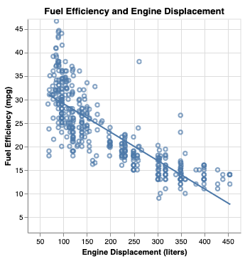

% Linear Regression
% CIS 241
% Dr. Ladd

# Linear Regression

## We can use correlation coefficients and correlation tests to learn the *strength* of a relationship, but how do we learn the *nature* of a relationship?

## Questions we might want to answer with regression:

- Does x influence y?
- Is crop growth rate improved by fertilizer?
- Do taller sprinters run faster?

## Linear prediction models, also called regression models, help us to answer these kind of questions, which explore *relationships*.

## A **prediction model** analyzes data that the researcher (*you!*) supplies, and calculates numerical coefficients to help with prediction.

## Linear regression is just one type of model!

# How does linear regression work?

## For many kinds of data, it is possible to "fit" a line to a set of data points. 

## That line represents the connection between an ________ (x-axis) and a ________ (y-axis) variable.

## And in this case, the target (dependent) variable is a function of the predictor (independent) variable. 

## To define predictors and a target variable, you need to *use your human brain*.

Come up with a *rationale* for why you think they would be related.

## This does *not* mean that x causes y! A regression can't show that.

It's *not* a good idea to just try to regress any set of variables together.

**Correlation does not mean causation!!**

## Regression can be for *explanation* or ***prediction***.

# Calculating linear regression

## $Y=mX+b$

Can also be written as: $Y=b_{1}X+b_{0}$

## $Y=b_{1}X+b_{0}$

$Y$ is your target (dependent) variable.

$X$ is your predictor (independent) variable. (There will eventually be many predictors.)

## $Y=b_{1}X+b_{0}$

Coefficients:

$b_{1}$ (or $m$) describes the *slope* of the line (and its direction).

$b_{0}$ (or $b$) describes the height of the line when $X$ is 0. This is called the y-intercept or simply the intercept.

## We can provide numeric variables ($X$ and $Y$), and Python will calculate the $b_{0}$ and $b_{1}$ values.

This is what it means to "fit" a linear model.

## In theory, if you know any $b_{0}$ and $b_{1}$, you can use any new X value to *predict* a Y value. Wow!

## Bivariate regression is great at *explanation* but lousy at *prediction*.

## Multiple Regression lets you add more independent variables.

Bivariate regression:

$Y=b_{0}+b_{1}x$

Multivariate regression:

$Y=b_{0}+b_{1}x_{1}+b_{2}x_{2}+b_{3}x_{3}+...$

## You can add more variables as predictors.

As many as you want, but make sure you *develop a rationale* (use your human brain)!

# Linear regression in Python

## Always start with exploratory analysis.

Do you have good reason to believe that a linear regression or predictive model would help? Is there a relationship between variables that's worth learning about?

```python
# Let's make a scatter plot of engine displacement and
# fuel efficiency, in the cars dataset.
```

---



## It looks like there might be a linear relationship!

We can see a general trend: as engine size goes up, fuel efficiency goes down. Now we're ready to try modeling this relationship as part of a larger linear regression model.

## Beware!


## For statistical modeling in Python, we can use `sklearn`.

```python
# You only need to import the functions you will use
# This may be different every time
from sklearn.linear_model import LinearRegression
from sklearn.model_selection import train_test_split
from sklearn.metrics import mean_squared_error, r2_score
```

## The scikit-learn modeling workflow

1. Choose your model
2. Choose predictor and target variables, test for validity
3. Split the data into train and test portions
4. Fit the model to your training data
5. Summarize or predict based on the model
6. Validate and assess the model

Full scikit-learn documentation [here](https://scikit-learn.org/stable/index.html)

## Why do we split the data?

A training set will determine the model's coefficients, and a test set will let us see how well it works on *new* data that it *hasn't already seen*.

## First we select our model: linear regression

That's why we imported the LinearRegression class above.

## Then we split the data.

```python

target = "Miles_per_Gallon" # Our target variable
predictors = ["Displacement", "Horsepower", "Acceleration"] # A list of predictors

X = cars[predictors]
y = cars[target]

# The train_test_split() function will create 4 variables
X_train, X_test, y_train, y_test = train_test_split(
    X, # The first argument is the X variable
    y, # The second argument is the Y variable
    test_size=0.4, # Proportion of the data in the test set
    random_state=0) # Set a random state so it's the same every time
```

## Then we can fit our model.

```python
our_model = LinearRegression() # Make an instance of this class
our_model.fit(X_train, y_train) # Run the fit() method on training data
```

Why did we get an error?

## Now we can look at the model's coefficients

```python
# We use f-strings to print complex things, with rounding
# We can use a for loop to print multiple coefficients
print(f"Intercept: {our_model.intercept_:.3f}")
for c,p in zip(our_model.coef_,X.columns):
    print(f"Coefficient for {p}: {c:.4f}")
```

---

With a coefficient for displacement of `-0.0384`, this linear regression provides evidence that as engine displacment increases, fuel efficiency decreases slightly!

For every additional unit of engine displacement, the expected fuel efficiency decreases by 0.0384.

**What would the other coefficients mean?**

The intercept indicates that if all predictor variables were 0, fuel efficiency would be 45.392 miles per gallon. Why doesn't this number make any sense?

*Be careful not to imply that there is a direct causal link, especially without more evidence or studies.*

## All together now.

```python
target = "Miles_per_Gallon" # Our target variable
predictors = ["Displacement", "Horsepower", "Acceleration"] # A list of predictors
X = cars[predictors]
y = cars[target]
# Split the data
X_train, X_test, y_train, y_test = train_test_split(
    X, 
    y, 
    test_size=0.4, 
    random_state=0)
# Fit the model
our_model = LinearRegression()
our_model.fit(X_train, y_train)
# View coefficients
print(f"Intercept: {our_model.intercept_:.3f}")
for c,p in zip(our_model.coef_,X.columns):
    print(f"Coefficient for {p}: {c:.4f}")
```

# Challenge: Seattle Housing Data

---

Try to make an effective multivariate linear model to predict housing prices in Seattle.

Take a look at the dataset and logically choose some predictors. Check for multicollinearity before you run your model! When you're done, try to predict housing price based on some new data points you create.

Load [house_sales.tsv](../data/house_sales.tsv). You'll need to open this with:

```python
housing = pd.read_csv("https://jrladd.com/CIS241/data/house_sales.tsv", sep="\t")
```

# Validation

## At every step of the modeling process, we must *validate*.

# How to Validate Predictor Variables

## There's no magic solution! You can try different options, but use your logic and don't just throw everything in there.

## Occam's Razor says that the simplest model is probably the best one.


## As you add variables, $R^{2}$ will increase and `RMSE` will decrease.

But think about *how much* it increases or decreases.

## Avoid Multicollinearity: when two predictor variables correlate.

This will confuse the model and mess up your results! It could even result in *false* predictions.

*You must test for multicollinearity **before** you select your predictors and run your model.*

## How do we find multicollinearity?

You can do a *pairwise* comparison of the variables you're thinking about. 

```python
alt.Chart(cars).mark_point().encode(
    alt.X(alt.repeat("column"), type='quantitative'),
    alt.Y(alt.repeat("row"), type='quantitative')
).properties(
    width=150,
    height=150
).repeat(
    row=predictors,
    column=predictors
)
```

## Compare your pairplot to the correlation matrix.

```python
cars[predictors].corr(numeric_only=True)
```

## You can consider categorical variables as predictors, too.

Reference coding converts categorical variables to a set of binary variables.

```python
X = pd.get_dummies(cars[predictors], drop_first=True)
```

The first category should always be left out as the reference (`drop_first=True`). All the remaining slopes are relative to that reference!

## When interpreting coefficients, watch out for *confounding variables*!

Ask yourself: is there an important variable that the data doesn't account for?

# Validating & Assessing Your Results

## Did our model do a good job?

## Let's *predict* based on our model.

The `predict()` method uses coefficients to calculate new values.

```python
# Let's focus on out-of-sample prediction for validation
predictions = our_model.predict(X_test)
predictions
```

We can predict with our training data (in-sample prediction) or with our test data (out-of-sample prediction).

## We can look at the *predictions* (fitted values) compared to the *residuals*.

Residuals are the differences between the actual observed values and the ones the model predicted.

```python
# Our out-of-sample residuals:
residuals = y_test - predictions
residuals
```

<small>Think of these as the "errors" that the modeling method produced. If the residuals are symmetrically distributed with the median close to zero, the model may fit the data well.</small>

## Root Mean Squared Error measures how much the residuals stray from the fitted values.

```python
# The raw value, in-sample
np.sqrt(mean_squared_error(y_test, predictions))

# Or neatly printed
print(f"Root mean squared error: {np.sqrt(mean_squared_error(y_test, predictions)):.2f}")
```

This is a good metric for comparing models.

## $R^{2}$ shows the amount (proportion) of variation in $Y$ that is accounted for by $X$.

```python
print(f"Coefficient of determination: {r2_score(y_test, predictions):.2f}")
```

This is also called the "coefficient of determination."

<small>$R^{2}$ ranges from 0 to 1. If it were 1, the variables would make a straight line. If it were 0, the x variable wouldn't predict the y variable at all.</small>

---

In this example, $R^{2}=0.67$, so our predictors account for about 67% of the variation in fuel efficiency.

There's no rule for what makes an $R^{2}$ "good." Consider the context and purpose of your analysis!

In an analysis of ecology or human behavior (very unpredictable) an $R^{2}$ of 0.20 or 0.30, might be considered good. In an analysis predicting mechanical repairs, or recovery from medical procedures, an $R^{2}$ of 0.60 or 0.70 might be considered very poor. 

## Are the residuals normally distributed, with a mean near 0?

```python
# First put the results into a dataframe
results = pd.DataFrame({'Predictions': predictions, 'Residuals':residuals})

alt.Chart(results, title="Histogram of Residuals").mark_bar().encode(
    x=alt.X('Residuals:Q', title="Residuals").bin(maxbins=20),
    y=alt.Y('count():Q', title="Value Counts")
)
```

You could also use a Q-Q plot for this!

## Does the model suggest heteroskedasticity?

Is the variance consistent across the range of predicted values?

```python
# Plot the absolute value of residuals against the predicted values
chart = alt.Chart(results, title="Testing for Heteroskedasticity").mark_point().encode(
    x=alt.X('Predictions:Q').title("Predicted Values"),
    y=alt.Y('y:Q').title("Absolute value of Residuals") 
).transform_calculate(y='abs(datum.Residuals)')

chart + chart.transform_loess('Predictions', 'y').mark_line()
```

If the line is horizontal, there's no heterskedasticity.

## Other validation methods

- Finding Outliers
- Cook's Distance and Leverage
- Check for independence of errors
- Partial residual plots

## Let's try these validation steps with your Seattle housing models!
