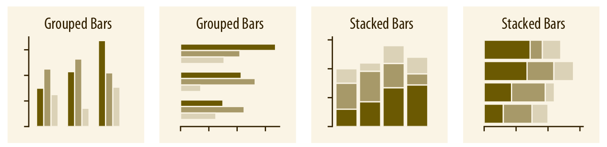
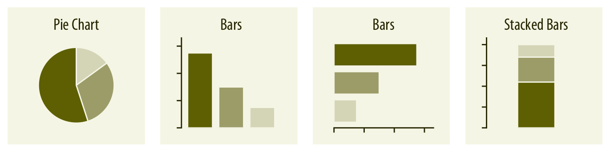
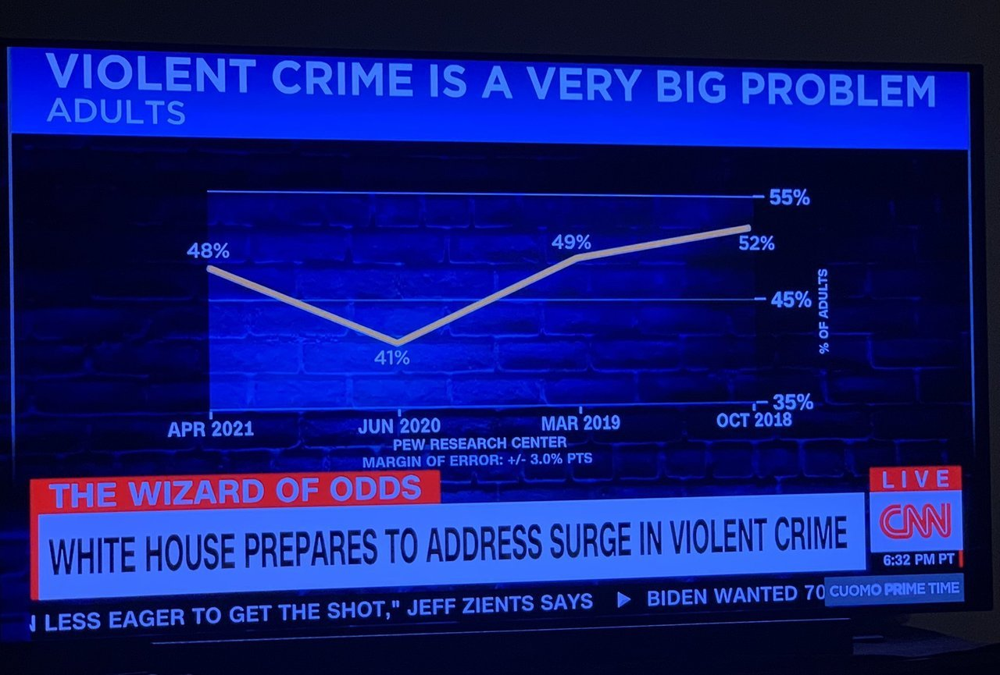

% Visualizing Data
% CIS 241, Dr. Ladd

# Why Do We Visualize Data?

---


## Visualization can be *exploratory*, *explanatory*, or both!

- Exploratory viz helps *us* (the researchers or analysts) understand the data.
- Explanatory viz helps *others* (the clients or audience) understand our analysis.
- Many visualizations do both of these things at once!

## Some Good Resources on Visualization

- Claus Wilke's [Fundamentals of Data Visualzation](https://clauswilke.com/dataviz/) (The illustrations in this slide show come from here!)
- [The Altair User Guide](https://altair-viz.github.io/user_guide/data.html)

# What Does Visualization Help Us to See?

## Viz Can Help Us See *Amounts*.


- Variable types: 1 categorical and 1 numerical
- Common graph types: Bar plot (Don't confuse the dot plot with the scatter plot!)

## Plot *Amounts* With Multiple Categories.



- Variable types: 2 or more categorical, 1 numerical
- Common graph types: Grouped or stacked bar, heat map

## Viz Can Help Us See *Distributions*.


- Variable type: 1 continuous (numerical)
- Common graph types: Histograms, Density plots, Q-Q plots

## *Distributions* with Multiple Categories.


- Variable types: 1 continuous (numerical), 1 categorical
- Common graph types: Box plots, Violin plots

## You Try It!

Look at the `taxis` data set. What visualization type would you use to compare the counts of each destination Borough? Which variables would you use, and what *kind* of variables are they? Jot down your answers.

## Viz Can Help Us See *Proportions*.



- Variable types: 1 numerical, 1 categorical
- Common graph types: Pie chart, Bar plot

## Viz Can Help Us See *Relationships*.


- Variable types: 2 continuous (numerical), (3 in a bubble chart)
- Common graph types: Scatter plot, Bubble Chart, Hex bins, Density contours

## You Try It!

Look at the `taxis` data again. What visualization type would you use to compare the distribution of tips among different taxi colors? Which variables would you use, and what *kind* of variables are they? Jot down your answers.

## Viz Helps Us See *Time*, *Location*, *Uncertainty*...


More on these viz types in future lessons!

# Make Great Viz with `Altair`

## Altair is *declarative*.

- You use the Grammar of Graphics approach to *declare* the parts of the visualization.
- Focus on *what you want to show* rather than how to make it appear.
- Builds on [Vega-Lite](https://vega.github.io/vega-lite/), works similarly to [ggplot2](https://ggplot2.tidyverse.org/) and [Tableau](https://www.tableau.com/why-tableau/what-is-tableau)

## Anatomy of an Altair Plot

## Import Seaborn and add default theme

```python
import seaborn as sns
```

```python
sns.set_theme()
# It's a good idea to use this every time
```

## Each Seaborn function looks for a data parameter and variables

```python
# A scatter plot as an example
sns.relplot(x="FirstVariable",y="SecondVariable",data=YourDataFrame)
```

In this example, `FirstVariable` becomes the x-axis and `SecondVariable` becomes the y-axis. You can also add a mapping for `hue` (i.e. color).

## Create different shapes and plot types with different functions.

- `sns.relplot()`: scatter plots and line plots (relationships)
- `sns.displot()`: histograms and frequency polygons (distributions)
- `sns.catplot()`: bar plots and boxplots (categories)
- and more we'll cover later!

Sometimes you'll use the `kind` parameter to set the type of plot!

## You Try It!

Create a plot to compare the distance a taxi traveled to the total fare using the `taxis` DataFrame. Then create the same plot but show color as the type of payment.

## Use the `col` parameter to create side-by-side plots for different categories.

```python
sns.displot(x="NumericalVariable", col="CategoricalVariable", data=YourDataFrame)
```

## Use `.set()` add your own title and axis label.

Never rely on the default column names! You can "chain" this function onto an existing Seaborn plot.

```python
sns.catplot(...).set(
    title="A Title for the Whole Plot",
    xlabel="A Better Label for X",
    ylabel="A Better Label for Y")
```

## You Try It!

Create a plot showing the distribution of tips in the `taxis` dataset. Give the plot a title and labels for both axes. Then show the distributions according to each pickup borough, in different columns. Finally, change the size of the bins in each distribution to show less detail (wider bars).

# Ugly, Bad, or Wrong

---


---


---


---


---


---



## More Examples of Bad Viz

[viz.wtf](https://viz.wtf/)

[r/dataisugly](https://www.reddit.com/r/dataisugly/)

