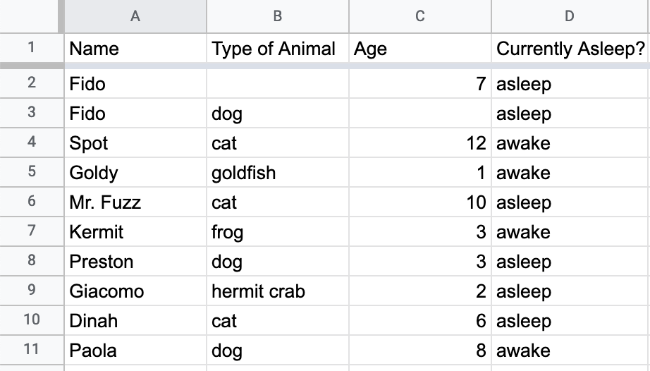
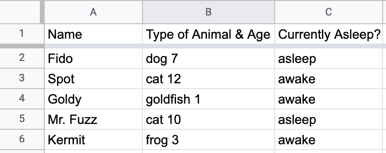
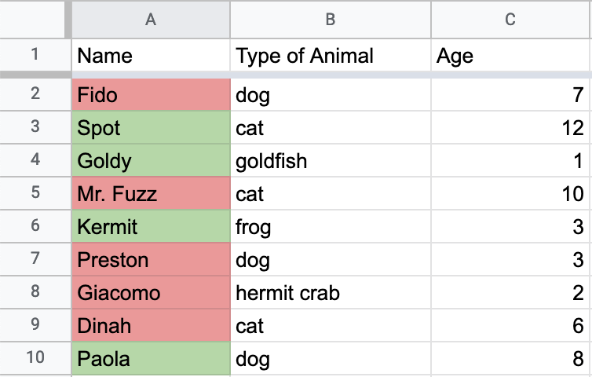
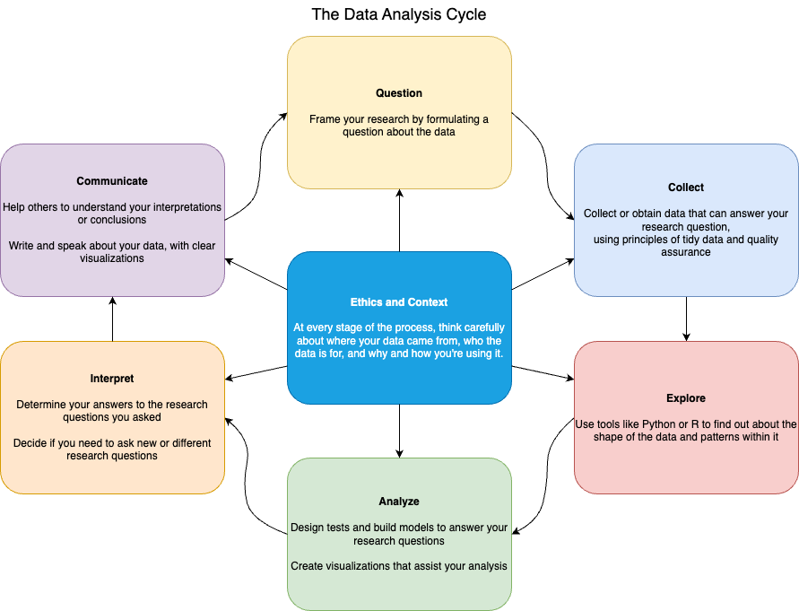

% What Is Data?
% CIS 241, Dr. Ladd

# Data's Many Forms

## Data Is Something That People *Make*.

## Data Can Be Rectangular (Tabular).

## Data Can be Structured (Relational).

## Data has Rows (Observations) and Columns (Features).

# Data Can Be Messy or Tidy.

## One Row for Each Observation.

## One Column for Each Type of Information.

## One Value in Every Cell.

## Avoid Visual "Data" (i.e. colors in a spreadsheet).

## Use Good Null Values.

## Save Data in Plain Text Files (CSV or TSV).

# Types of Data

## Data Can Be Quantitative (Numerical).

- Discrete (integers or whole numbers)
- Continuous (any value, including decimals)

## Data Can Be Qualitative (Categorical).

- Ordinal (categories have an order or hierarchy)
- Nominal (categories don't have an order)

---

[xkcd.com/2054](https://xkcd.com/2054/)

# What is Metadata?

## Types of Metadata

- *Descriptive* metadata can help you find and understand a dataset or resource. (e.g. titles and authors of books)
- *Administrative* metadata can help you manage a resource and tell you about how it was created. (e.g. publishers of books, or ebook file formats)
- *Structural* metadata can help you understand the different parts of the dataset and their relationship. (e.g. column labels, or tables of contents in books)

## Metadata has standards for interoperability.

[Dublin Core](http://dublincore.org/) -- 13 features common to digital data

[DDI: Data Documentation Initiative](https://www.ddialliance.org/) -- social, behavioral, and economic sciences

[MARC: MAchine Readable Cataloging](https://www.loc.gov/marc/) -- libraries, books & media

# The Data Analysis Cycle

---

---

[xkcd.com/2239](https://xkcd.com/2239/)

